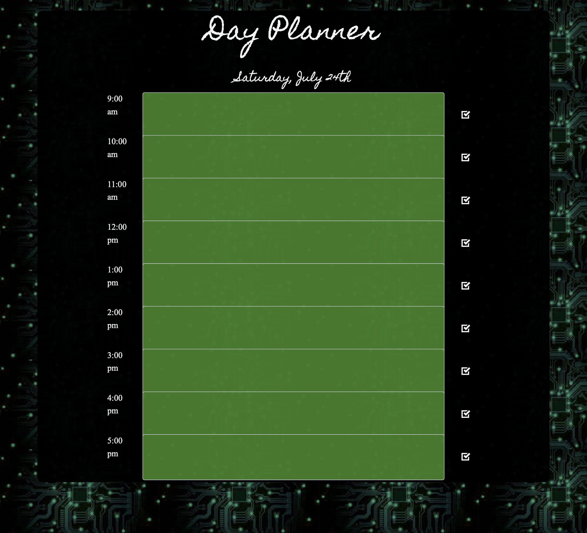

# Work/Day Scheduler  
## Project Description

Our assigment was to create a simple single page web application, which can we used as a daily planner, a work day planner, or any other type of day planner.

In this project, I am utilizing javascript, HTML, and CSS (framework and some custom styling). I am also utilizing localStorage to keep a track of the user's inputs into the calander. 

The hour alloted to each slot will change color depeneding on the condiiton of the event on the calander (past,present.future)

## Contents
1. [Deployed Page](#deployed-page)
2. [Day Scheduler Comments](#deploymed-page)
3. [Contributions](#contributions)

## Deployed Page

[Deployed GitPage](https://github.com/MichaelAdamGroberman/Day-Scheduler)

## Day Scheduler Comments
* picked my CSS frameworks and scripts that will be used for this assignment 
* started with my HTML page to wrote/mockup the layout from our assignment 
* Styled the html page with bootstrap and custom styling in style.css
* Wrote the javascript, seperating each time slot into it's own section.
* Would love to scale this assignment out to include gmail and goole calander integration, or have it build it react.

## Contributions
* Developed, written, and commented by Michael Groberman
